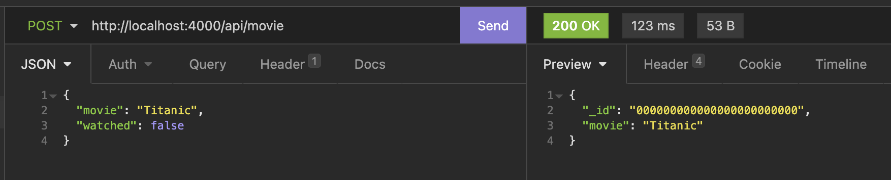
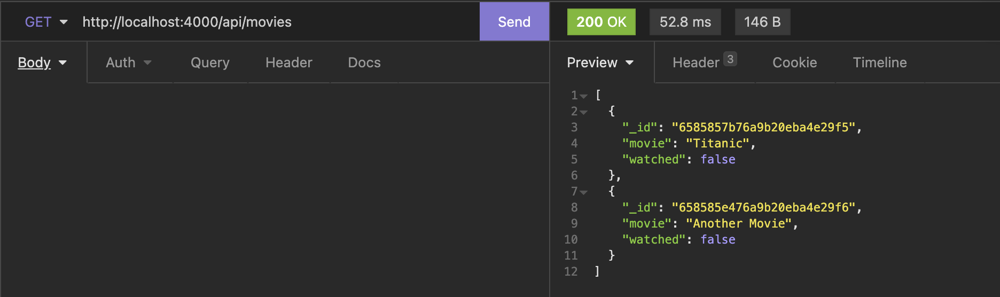
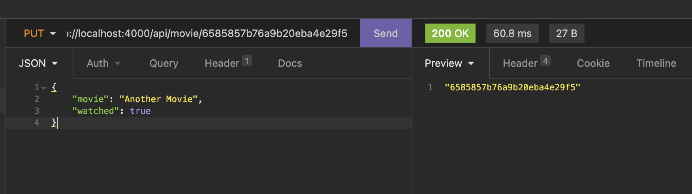
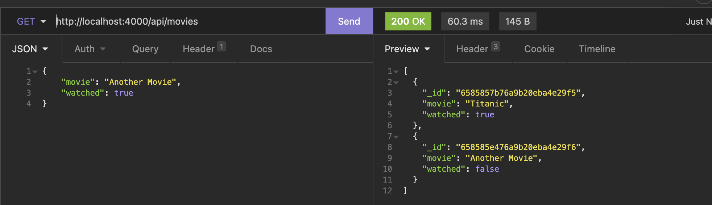
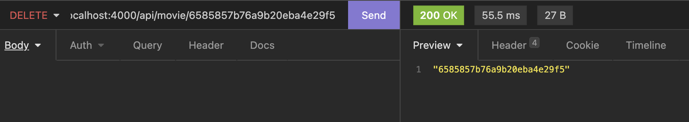
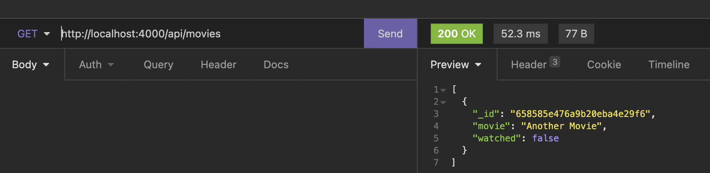
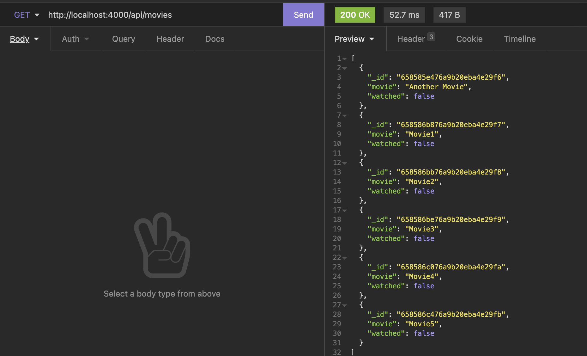
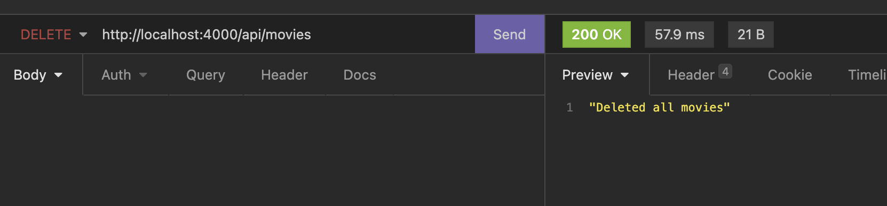
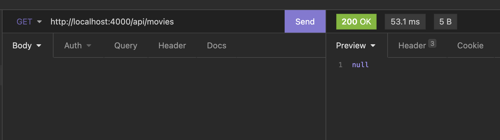

# Go API with MongoDB

This is a simple Go API using MongoDB as the database to manage a watchlist of movies. The API provides endpoints to perform basic CRUD operations on the movie watchlist.

## Table of Contents

- [Learning Purpose](#learning-purpose)
- [Installation](#installation)
- [Usage](#usage)
- [Endpoints](#endpoints)
- [Database Configuration](#database-configuration)
- [Testing API](#testing-api)

## Learning Purpose

This project is created with the sole purpose of learning (Based on Online tutorials) how to integrate Go with MongoDB and implement basic CRUD operations. It serves as a practical example for those who are interested in understanding:

- Connecting a Go application to a MongoDB database.
- Implementing RESTful API endpoints for CRUD operations.
- Structuring a basic web application in Go.

## Installation

To run this API locally, make sure you have Go installed on your machine. Clone the repository and install the required dependencies:

```bash
git clone https://github.com/aswinayyolath/goapimongoDB.git
cd goapimongoDB
go get -u ./...
```

## Usage

To start the API, run the following command:

```bash
go run main.go
```

The API will be accessible at http://localhost:4000.

## Endpoints

### 1. Show All Movies

- **URL**: `/api/movies`
- **Method**: `GET`
- **Description**: Get a list of all movies in the watchlist.

### 2. Create Movie

- **URL**: `/api/movie`
- **Method**: `POST`
- **Description**: Add a new movie to the watchlist.

### 3. Mark As Watched

- **URL**: `/api/movie/{id}`
- **Method**: `PUT`
- **Description**: Mark a specific movie as watched.

### 4. Delete Movie

- **URL**: `/api/movie/{id}`
- **Method**: `DELETE`
- **Description**: Delete a specific movie from the watchlist.

### 5. Delete All Movies

- **URL**: /api/movies
- **Method**: DELETE
- **Description**: Delete all movies from the watchlist.

## Database Configuration

The MongoDB connection is configured in the `dbhelper.go` file. The init function establishes a connection to the MongoDB database using the provided connection string. The database name is set to "netflix," and the collection name is set to "watchlist." Modify the connectionString constant if you need to connect to a different MongoDB instance.

```go
const connectionString = "<DatabaseConnection>"
const dbName = "netflix"
const collectionName = "watchlist"
```

## Testing API

#### Create Movie



#### Get All Movies



#### Update movie




#### Delete One Movie




#### Delete All Movies



